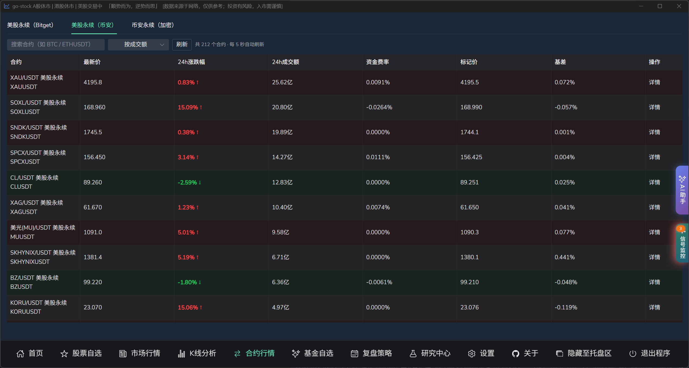
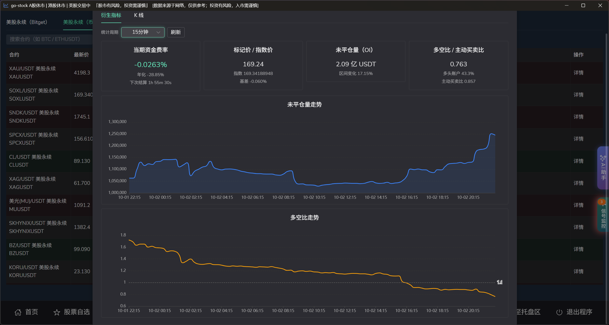
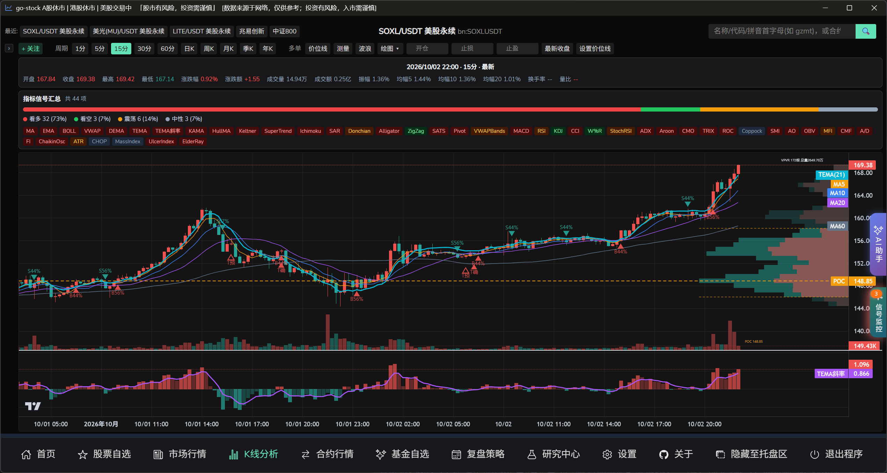

# 合约行情功能说明

## 功能概述

合约行情功能把**永续合约**接入了 go-stock：新增一个独立的「合约行情」页面集中查看合约榜单，同时 K 线分析、买卖点信号监控、AI 分析也都能识别并使用合约代码。

## 合约行情页

### 入口

左侧菜单的「**合约行情**」项，默认显示。可在设置页「合约行情：」开关（`enableContracts`）关闭，关闭后菜单与页面同时隐藏。

### 页面结构

页面分为两个页签：

- 美股永续
- 加密永续

每个页签是一张合约榜单表格，列包括：

`合约`、`最新价`、`24h涨跌幅`、`24h成交额`、`资金费率`、`标记价`、`基差`、`操作`

- 「操作」列可一键打开该合约的 K 线。
- **涨跌幅按国内习惯配色**：涨为红色、跌为绿色，与 A 股页面口径一致。
- 成交额按中文单位缩写（万 / 亿）。

### 合约详情：衍生指标

点击榜单中任一合约，弹出合约详情，内含「衍生指标」与「K线」两个页签。衍生指标页签可切换统计周期，并用卡片展示该合约的衍生数据：

- **当期资金费率**：当前费率、年化利率与下次结算倒计时。
- **标记价 / 指数价**：标记价、指数价与两者基差。
- **未平仓量（OI）**：持仓名义价值及区间变化。
- **多空比 / 主动买卖比**：多空比、多头账户占比与主动买卖比。

下方另含**未平仓量走势**与**多空比走势**两张折线图。

### 刷新频率

榜单与其中的 K 线均为 **5 秒**轮询。合约是 7×24 交易、波动快，因此比股票默认的刷新节奏更密（股票默认 60 秒，通达信 MAC 数据源 10 秒）。后端对行情与 K 线的缓存 TTL 也同步降到了 **3 秒**左右，并对同一个 key 的并发请求做去重，避免高频轮询打爆上游。

## K 线分析支持合约

### 搜索与切换

在 K 线分析页的搜索框或快捷搜索面板里输入即可联想合约：

- 支持直接输入合约代码（如 `btcusdt`、`aapl`）
- 支持输入带前缀的代码（`bn:` / `bt:`）
- 支持用展示名匹配（如 `苹果`）

选中后按 `bn:` / `bt:` 前缀**直通**，不会走东财的交易所后缀转换（否则会被当成美股代码拼成 `GZMT.US` 之类）。合约的展示名由后端合约清单解析，取不到时回退为去掉前缀的代码。

### K 线与复权

- 合约 K 线固定 **5 秒**刷新。
- 永续合约**不做复权**（`adjustForCode` 对 `bn:` / `bt:` 返回 `none`），与图表默认口径一致；此前「合约分时周期复权快照与请求口径不一致」会导致 1 分钟等周期长期不刷新，现已修复。

## 买卖点信号监控支持合约

信号监控池中可以添加合约（搜索联想同样支持 symbol、展示名、去前缀关键字），监控行为针对合约做了三处适配：

1. **交易时段门控放行**：池中存在 `bn:` / `bt:` 合约时直接视为「市场开放」，否则 7×24 的加密合约与美股永续会在 A 股休市时段被整体跳过、扫不出信号。
2. **复权口径对齐**：合约按不复权处理，与 K 线图表一致，避免信号价格与图上价格错位。
3. **语音播报念中文别名**：后台语音提醒优先使用合约的中文别名；名称缺失时去掉 `bn:` / `bt:` 前缀，避免直接念出一串代码。

信号列表可直接跳转到对应合约的 K 线弹窗。

## AI 分析支持

AI / Agent 侧同步登记了合约工具，可在对话中直接查询永续合约的行情与 K 线（返回 Markdown 表格）。后端同时提供了合约的客户端与 API 封装，供其他功能调用。

## 相关设置项

设置页中与合约相关的配置：

| 设置项 | 说明 | 默认 |
|:--|:--|:--|
| 合约行情： | 合约行情页与菜单的显隐开关 | 开启 |
| 合约代理(可选) | 合约行情专用 HTTP 代理，与爬虫代理完全独立，仅作用于合约接口；如 `http://127.0.0.1:7890`，留空表示直连 | 留空（直连） |

合约代理与全局「爬虫http代理」**互相隔离**：配置爬虫代理不会影响合约接口，反过来也一样。

## 注意事项

1. 目前只支持 **USDT 本位永续合约**，不含交割合约、币本位合约与现货。
2. 合约接口均在境外，网络不通时请配置上表中的合约代理；代理只对合约接口生效。
3. 合约无固定交易时段，信号监控对合约不做休市判断——请自行注意流动性较差的时段。
4. 合约行情与信号仅为数据展示与提醒，不构成任何投资建议；合约带杠杆，风险高于现货。